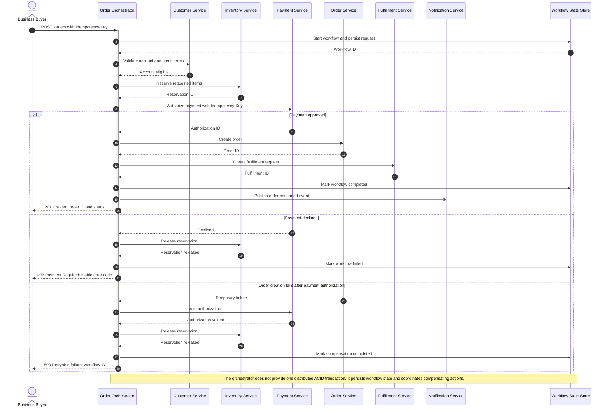

# API orchestration: enterprise order with compensation

```mermaid
sequenceDiagram
    autonumber
    actor Buyer as Business Buyer
    participant Orchestrator as Order Orchestrator
    participant Customer as Customer Service
    participant Inventory as Inventory Service
    participant Payment as Payment Service
    participant Order as Order Service
    participant Fulfillment as Fulfillment Service
    participant Notify as Notification Service
    participant State as Workflow State Store

    Buyer->>Orchestrator: POST /orders with Idempotency-Key
    activate Orchestrator
    Orchestrator->>State: Start workflow and persist request
    State-->>Orchestrator: Workflow ID
    Orchestrator->>Customer: Validate account and credit terms
    Customer-->>Orchestrator: Account eligible
    Orchestrator->>Inventory: Reserve requested items
    Inventory-->>Orchestrator: Reservation ID
    Orchestrator->>Payment: Authorize payment with Idempotency-Key

    alt Payment approved
        Payment-->>Orchestrator: Authorization ID
        Orchestrator->>Order: Create order
        Order-->>Orchestrator: Order ID
        Orchestrator->>Fulfillment: Create fulfillment request
        Fulfillment-->>Orchestrator: Fulfillment ID
        Orchestrator->>State: Mark workflow completed
        Orchestrator-)Notify: Publish order-confirmed event
        Orchestrator-->>Buyer: 201 Created: order ID and status
    else Payment declined
        Payment-->>Orchestrator: Declined
        Orchestrator->>Inventory: Release reservation
        Inventory-->>Orchestrator: Reservation released
        Orchestrator->>State: Mark workflow failed
        Orchestrator-->>Buyer: 402 Payment Required: stable error code
    else Order creation fails after payment authorization
        Order-->>Orchestrator: Temporary failure
        Orchestrator->>Payment: Void authorization
        Payment-->>Orchestrator: Authorization voided
        Orchestrator->>Inventory: Release reservation
        Inventory-->>Orchestrator: Reservation released
        Orchestrator->>State: Mark compensation completed
        Orchestrator-->>Buyer: 503 Retryable failure: workflow ID
    end
    deactivate Orchestrator

    Note over Orchestrator,State: The orchestrator does not provide one distributed ACID transaction. It persists workflow state and coordinates compensating actions.
```