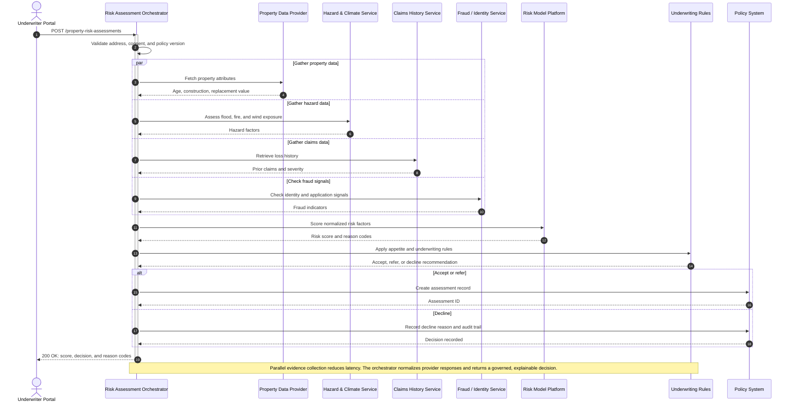

# API orchestration: property insurance risk score

```mermaid
sequenceDiagram
    autonumber
    actor Underwriter as Underwriter Portal
    participant Orchestrator as Risk Assessment Orchestrator
    participant Property as Property Data Provider
    participant Hazard as Hazard & Climate Service
    participant Claims as Claims History Service
    participant Fraud as Fraud / Identity Service
    participant Model as Risk Model Platform
    participant Rules as Underwriting Rules
    participant Policy as Policy System

    Underwriter->>Orchestrator: POST /property-risk-assessments
    activate Orchestrator
    Orchestrator->>Orchestrator: Validate address, consent, and policy version

    par Gather property data
        Orchestrator->>Property: Fetch property attributes
        Property-->>Orchestrator: Age, construction, replacement value
    and Gather hazard data
        Orchestrator->>Hazard: Assess flood, fire, and wind exposure
        Hazard-->>Orchestrator: Hazard factors
    and Gather claims data
        Orchestrator->>Claims: Retrieve loss history
        Claims-->>Orchestrator: Prior claims and severity
    and Check fraud signals
        Orchestrator->>Fraud: Check identity and application signals
        Fraud-->>Orchestrator: Fraud indicators
    end

    Orchestrator->>Model: Score normalized risk factors
    Model-->>Orchestrator: Risk score and reason codes
    Orchestrator->>Rules: Apply appetite and underwriting rules
    Rules-->>Orchestrator: Accept, refer, or decline recommendation

    alt Accept or refer
        Orchestrator->>Policy: Create assessment record
        Policy-->>Orchestrator: Assessment ID
    else Decline
        Orchestrator->>Policy: Record decline reason and audit trail
        Policy-->>Orchestrator: Decision recorded
    end

    Orchestrator-->>Underwriter: 200 OK: score, decision, and reason codes
    deactivate Orchestrator

    Note over Orchestrator,Rules: Parallel evidence collection reduces latency. The orchestrator normalizes provider responses and returns a governed, explainable decision.
```